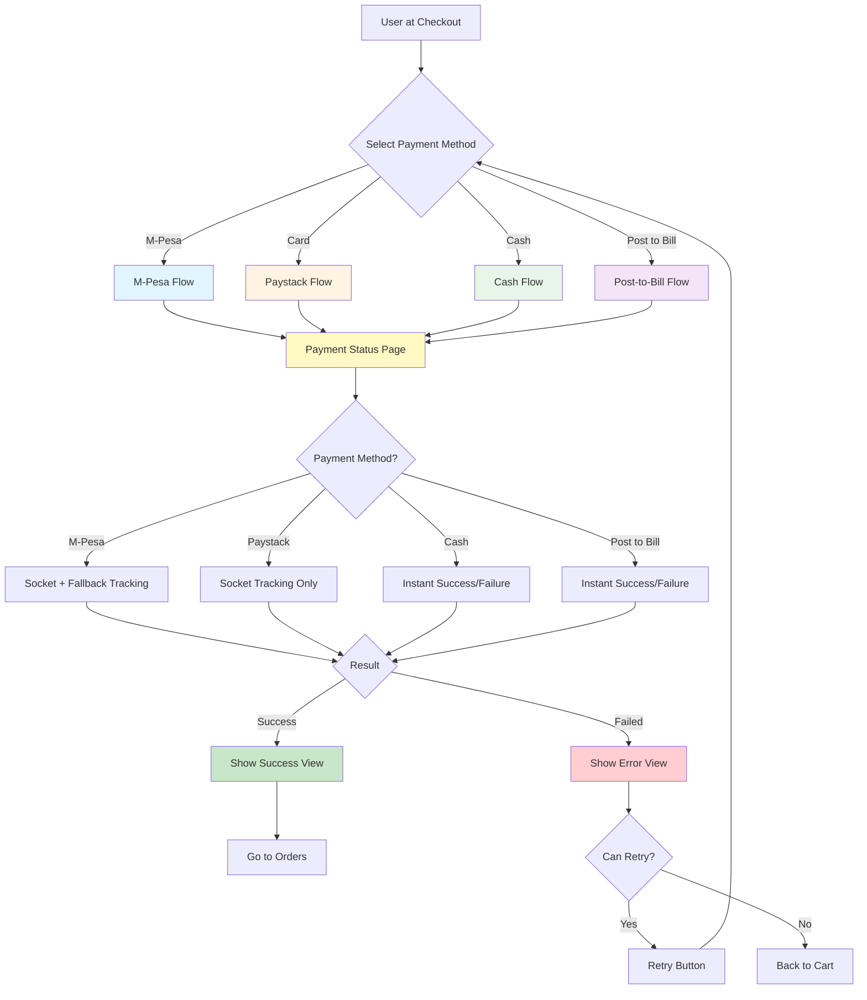
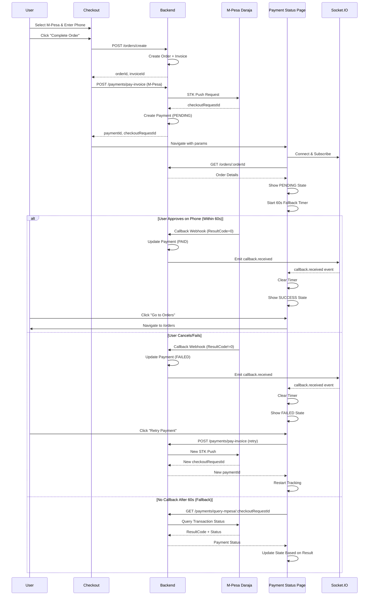
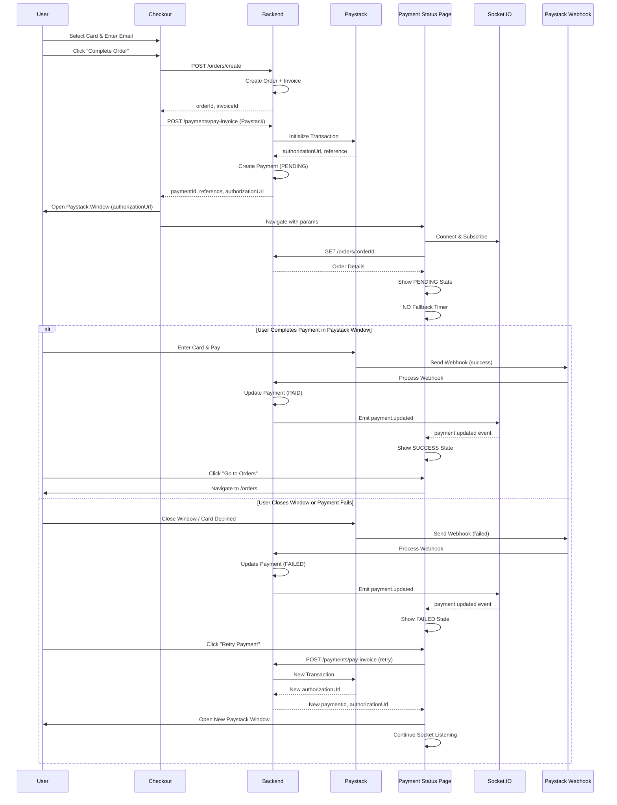
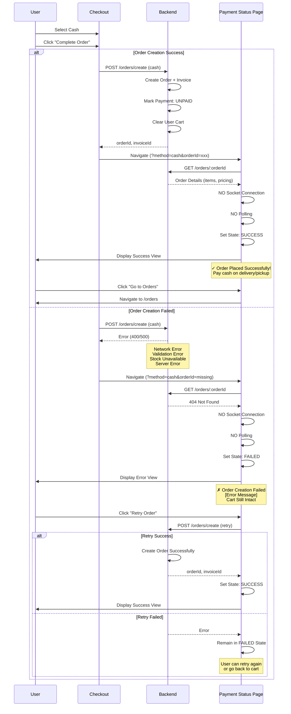
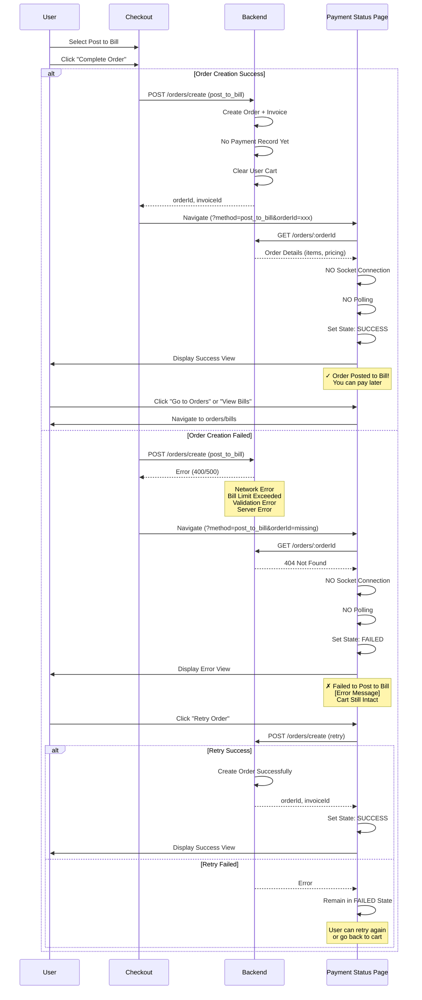
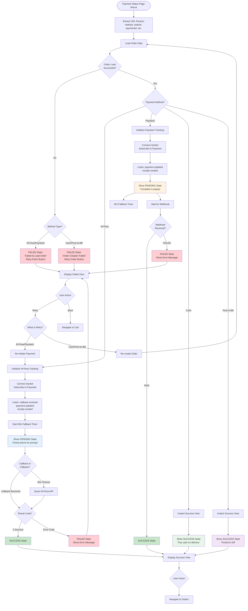
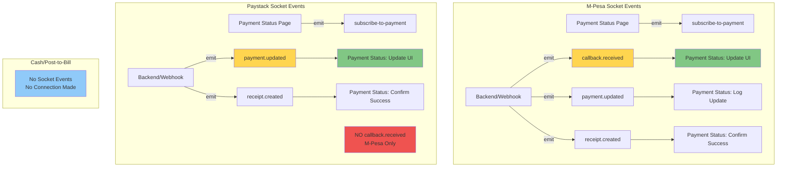
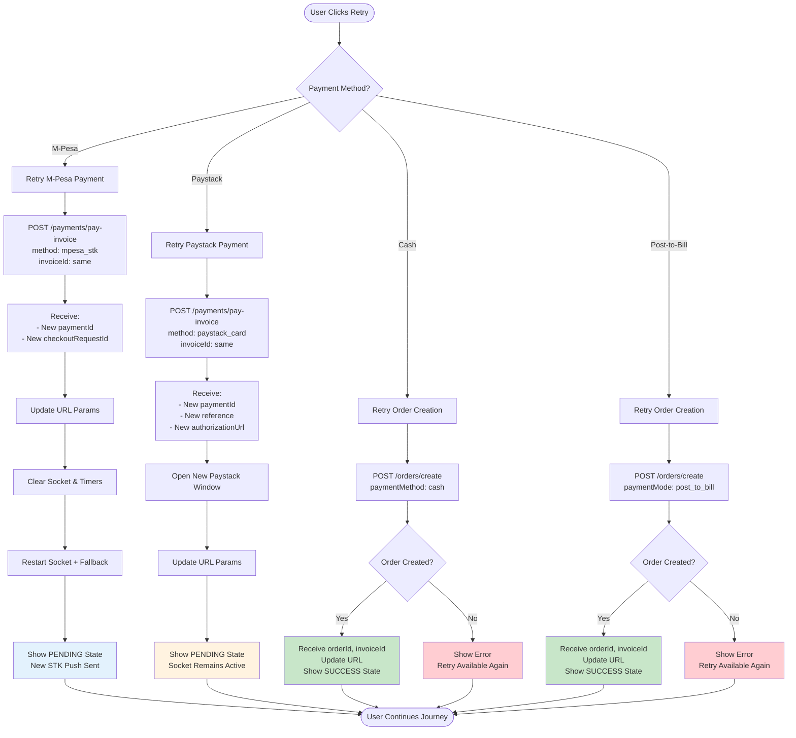
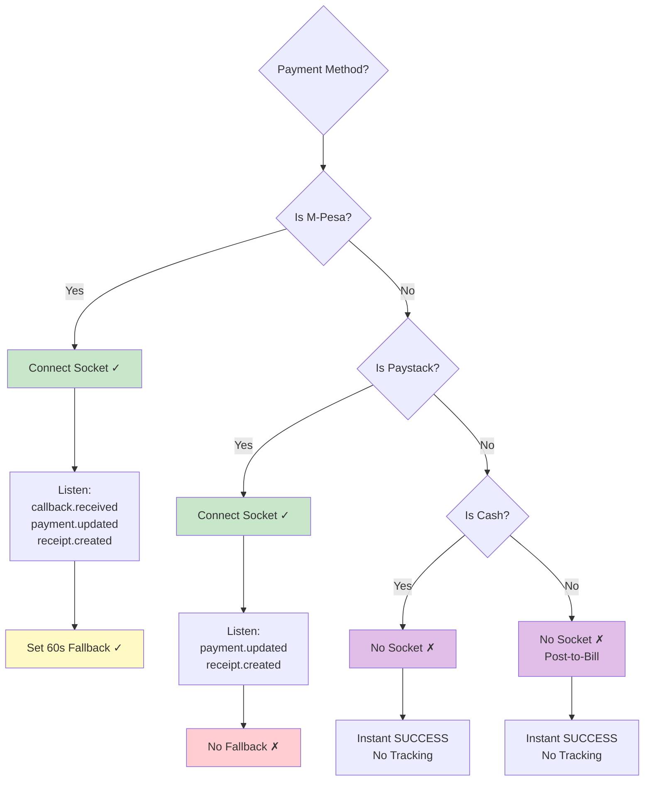
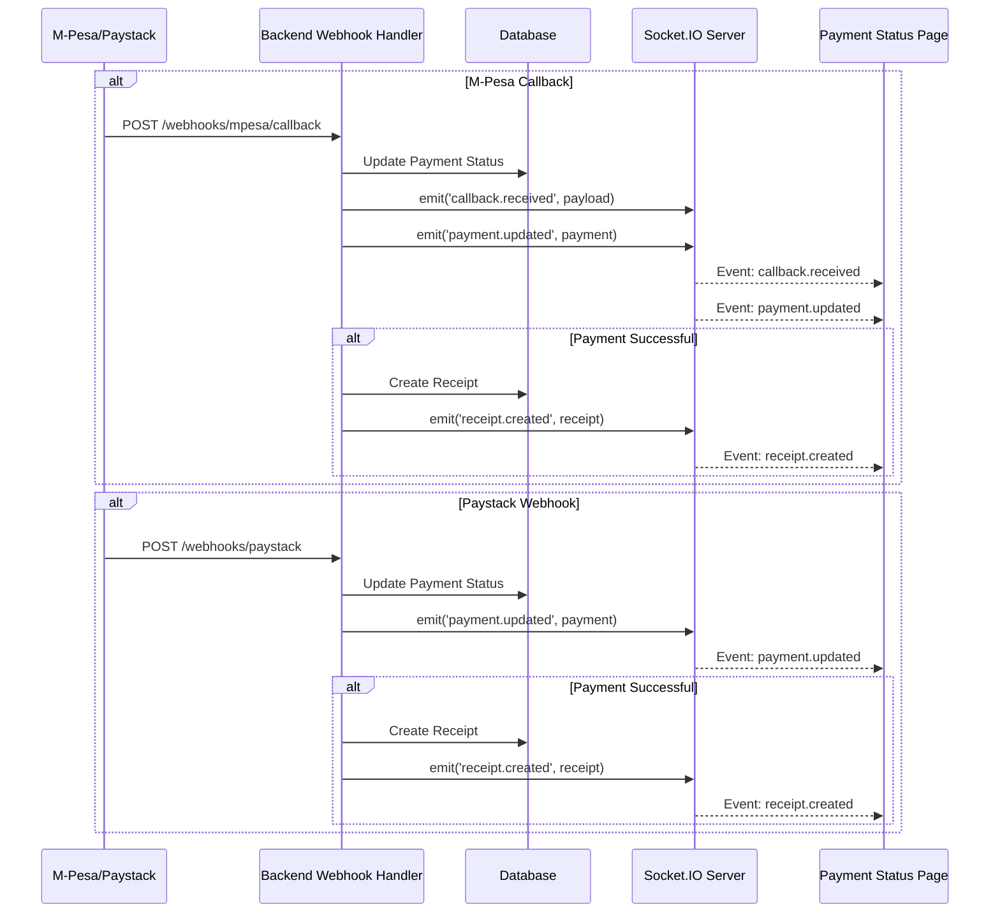

# Payment Status Flow Diagrams

This document contains visual flow diagrams for all payment methods in the TEO KICKS platform.

---

## 1. Overall Payment Flow - High Level



---

## 2. M-Pesa Flow - Detailed



---

## 3. Paystack Flow - Detailed



---

## 4. Cash Flow - Detailed



---

## 5. Post-to-Bill Flow - Detailed



---

## 6. Payment Status Page - Method Branching Logic



---

## 7. Socket Event Flow - M-Pesa vs Paystack



---

## 8. Retry Logic Flow



---

## 9. State Transition Timeline

```
═══════════════════════════════════════════════════════════════════════

M-PESA TIMELINE:
─────────────────────────────────────────────────────────────────────

t=0s          t=5-60s              t=60s+           Final
  │               │                   │               │
  ▼               ▼                   ▼               ▼
LOADING ──────► PENDING ──────► (Callback) ──────► SUCCESS
                    │                                  │
                    │                                  ▼
                    └──────────► (Fallback) ──────► FAILED
                                  Query API         (Retry Available)

═══════════════════════════════════════════════════════════════════════

PAYSTACK TIMELINE:
─────────────────────────────────────────────────────────────────────

t=0s          t=Variable           No Timeout       Final
  │               │                                   │
  ▼               ▼                                   ▼
LOADING ──────► PENDING ──────► (Webhook) ──────► SUCCESS
                    │                                  │
                    │                                  ▼
                    └──────────► (Webhook) ──────► FAILED
                               or User Closes     (Retry Available)
                                  Window

═══════════════════════════════════════════════════════════════════════

CASH TIMELINE:
─────────────────────────────────────────────────────────────────────

t=0s          Immediate
  │               │
  ▼               ▼
LOADING ──────► SUCCESS  (if order created)
    │               │
    └──────────► FAILED   (if order creation failed)
                    │
                    └──────► (Retry Order) ──────► SUCCESS/FAILED

═══════════════════════════════════════════════════════════════════════

POST-TO-BILL TIMELINE:
─────────────────────────────────────────────────────────────────────

t=0s          Immediate
  │               │
  ▼               ▼
LOADING ──────► SUCCESS  (if order created)
    │               │
    └──────────► FAILED   (if order creation failed)
                    │
                    └──────► (Retry Order) ──────► SUCCESS/FAILED

═══════════════════════════════════════════════════════════════════════
```

---

## 10. Complete User Journey - All Methods

```
┌─────────────────────────────────────────────────────────────────────┐
│                         CHECKOUT PAGE                               │
└─────────────────────────────────────────────────────────────────────┘
                                  │
                    ┌─────────────┼─────────────┬───────────────┐
                    │             │             │               │
                    ▼             ▼             ▼               ▼
            ┌──────────┐   ┌──────────┐   ┌────────┐   ┌────────────┐
            │  M-Pesa  │   │ Paystack │   │  Cash  │   │ Post-to-   │
            │          │   │          │   │        │   │    Bill    │
            └──────────┘   └──────────┘   └────────┘   └────────────┘
                    │             │             │               │
                    │             │             │               │
            Create Order    Create Order   Create Order   Create Order
            + Invoice       + Invoice      + Invoice      + Invoice
                    │             │             │               │
            Initiate STK    Init Paystack       │               │
                    │             │             │               │
                    │       Open Paystack       │               │
                    │         Window            │               │
                    │             │             │               │
                    └─────────────┴─────────────┴───────────────┘
                                  │
                                  ▼
┌─────────────────────────────────────────────────────────────────────┐
│                    PAYMENT STATUS PAGE                              │
└─────────────────────────────────────────────────────────────────────┘
                                  │
                    ┌─────────────┼─────────────┬───────────────┐
                    │             │             │               │
                    ▼             ▼             ▼               ▼
            ┌──────────────┐ ┌───────────┐ ┌──────────┐ ┌────────────┐
            │ Socket +     │ │ Socket    │ │ Instant  │ │ Instant    │
            │ 60s Fallback │ │ Only      │ │ Success  │ │ Success    │
            │              │ │           │ │          │ │            │
            │ PENDING      │ │ PENDING   │ │ SUCCESS  │ │ SUCCESS    │
            │   ↓          │ │   ↓       │ │          │ │            │
            │ SUCCESS/     │ │ SUCCESS/  │ │          │ │            │
            │ FAILED       │ │ FAILED    │ │          │ │            │
            └──────────────┘ └───────────┘ └──────────┘ └────────────┘
                    │             │             │               │
                    └─────────────┴─────────────┴───────────────┘
                                  │
                                  ▼
                            {Final State}
                                  │
                    ┌─────────────┼─────────────┐
                    │             │             │
                    ▼             ▼             ▼
            ┌────────────┐  ┌────────────┐  ┌──────────────┐
            │  SUCCESS   │  │   FAILED   │  │   PENDING    │
            │            │  │            │  │  (Timeout)   │
            │ Go to      │  │ Retry      │  │              │
            │ Orders     │  │ Payment/   │  │ Manual       │
            │            │  │ Order      │  │ Check        │
            └────────────┘  └────────────┘  └──────────────┘
```

---

## 11. Error Recovery Paths

```
┌─────────────────────────────────────────────────────────────────────┐
│                         ERROR STATES                                │
└─────────────────────────────────────────────────────────────────────┘

┌─ M-Pesa Error ──────────────────────────────────────────────────────┐
│                                                                      │
│  Order Exists ✓ → Payment Failed                                    │
│                                                                      │
│  Recovery Options:                                                   │
│  1. Retry Payment (new STK push)                                    │
│  2. Go to Orders (order saved, pay later)                           │
│  3. Contact Support                                                 │
│                                                                      │
│  Cart: Already cleared (order exists)                               │
│                                                                      │
└──────────────────────────────────────────────────────────────────────┘

┌─ Paystack Error ────────────────────────────────────────────────────┐
│                                                                      │
│  Order Exists ✓ → Payment Failed                                    │
│                                                                      │
│  Recovery Options:                                                   │
│  1. Retry Payment (new Paystack window)                             │
│  2. Go to Orders (order saved, pay later)                           │
│  3. Contact Support                                                 │
│                                                                      │
│  Cart: Already cleared (order exists)                               │
│                                                                      │
└──────────────────────────────────────────────────────────────────────┘

┌─ Cash Error ────────────────────────────────────────────────────────┐
│                                                                      │
│  Order Creation Failed ✗                                            │
│                                                                      │
│  Recovery Options:                                                   │
│  1. Retry Order Creation (same cart items)                          │
│  2. Back to Cart (modify items)                                     │
│  3. Contact Support                                                 │
│                                                                      │
│  Cart: Still intact (order never created)                           │
│                                                                      │
└──────────────────────────────────────────────────────────────────────┘

┌─ Post-to-Bill Error ────────────────────────────────────────────────┐
│                                                                      │
│  Order Creation Failed ✗                                            │
│                                                                      │
│  Recovery Options:                                                   │
│  1. Retry Order Creation (same cart items)                          │
│  2. Back to Cart (modify items)                                     │
│  3. Pay Existing Bills (if limit exceeded)                          │
│  4. Contact Support                                                 │
│                                                                      │
│  Cart: Still intact (order never created)                           │
│                                                                      │
└──────────────────────────────────────────────────────────────────────┘
```

---

## 12. Socket vs No Socket Decision Tree



---

## 13. Payment Status Page Component Structure

```
┌────────────────────────────────────────────────────────────────────┐
│                      Payment Status Page                           │
├────────────────────────────────────────────────────────────────────┤
│                                                                    │
│  ┌─────────────────────────────────────────────────────────────┐  │
│  │                    Status Icon & Title                       │  │
│  │  [Spinner/Checkmark/X]  +  [Title Text]                     │  │
│  └─────────────────────────────────────────────────────────────┘  │
│                                                                    │
│  ┌─────────────────────────────────────────────────────────────┐  │
│  │                    Status Message                            │  │
│  │  Method-specific message about current state                │  │
│  └─────────────────────────────────────────────────────────────┘  │
│                                                                    │
│  ┌─────────────────────────────────────────────────────────────┐  │
│  │                Loading Indicator (Optional)                  │  │
│  │  Shown during fallback API call for M-Pesa                  │  │
│  └─────────────────────────────────────────────────────────────┘  │
│                                                                    │
│  ┌─────────────────────────────────────────────────────────────┐  │
│  │                    Order Items Section                       │  │
│  │  ┌──────────────────────────────────────────────────────┐   │  │
│  │  │  [Product Image] Product Name                        │   │  │
│  │  │  Variant: Size 10                                    │   │  │
│  │  │  Qty: 2                                              │   │  │
│  │  │  KSh 1,500.00                                        │   │  │
│  │  └──────────────────────────────────────────────────────┘   │  │
│  │  (Repeat for each item)                                     │  │
│  └─────────────────────────────────────────────────────────────┘  │
│                                                                    │
│  ┌─────────────────────────────────────────────────────────────┐  │
│  │                  Price Breakdown Section                     │  │
│  │  Subtotal:              KSh 3,000.00                        │  │
│  │  Discounts:            -KSh   300.00                        │  │
│  │  Packaging:             KSh    50.00                        │  │
│  │  Delivery:              KSh   200.00                        │  │
│  │  ────────────────────────────────────                       │  │
│  │  Total:                 KSh 2,950.00                        │  │
│  └─────────────────────────────────────────────────────────────┘  │
│                                                                    │
│  ┌─────────────────────────────────────────────────────────────┐  │
│  │                     Payment ID                               │  │
│  │  Payment ID: pay_xxxxxxxxxxxx (small text)                  │  │
│  └─────────────────────────────────────────────────────────────┘  │
│                                                                    │
├────────────────────────────────────────────────────────────────────┤
│                      Action Buttons (Fixed Bottom)                 │
│                                                                    │
│  SUCCESS:  [       Go to Orders        ]                          │
│                                                                    │
│  FAILED:   [ Retry Payment/Order ]  [ Close / Back to Cart ]     │
│                                                                    │
│  PENDING:  [         Hide          ]                              │
│                                                                    │
└────────────────────────────────────────────────────────────────────┘
```

---

## 14. Decision Matrix - Quick Reference

### Should I Connect Socket?

| Method | Connect? | Why? |
|--------|----------|------|
| M-Pesa | ✅ YES | Real-time callback updates |
| Paystack | ✅ YES | Webhook-driven updates |
| Cash | ❌ NO | No payment tracking |
| Post-to-Bill | ❌ NO | No payment tracking |

---

### Should I Set Fallback Timer?

| Method | Set Fallback? | Duration | Action |
|--------|---------------|----------|--------|
| M-Pesa | ✅ YES | 60 seconds | Query M-Pesa API |
| Paystack | ❌ NO | N/A | No query API available |
| Cash | ❌ NO | N/A | Instant determination |
| Post-to-Bill | ❌ NO | N/A | Instant determination |

---

### What Should Retry Button Do?

| Method | Retry Action | API Called | Result |
|--------|--------------|------------|--------|
| M-Pesa | Re-initiate payment | `POST /payments/pay-invoice` | New STK push |
| Paystack | Re-initiate payment | `POST /payments/pay-invoice` | New Paystack window |
| Cash | Re-create order | `POST /orders/create` | New order attempt |
| Post-to-Bill | Re-create order | `POST /orders/create` | New order attempt |

---

### When Can Order Creation Fail?

| Scenario | Affects | User Sees | Recovery |
|----------|---------|-----------|----------|
| Network error | All methods | "Network error" | Retry |
| Validation error | All methods | "Invalid data" | Back to cart, fix |
| Stock unavailable | All methods | "Stock unavailable" | Back to cart, update |
| Bill limit exceeded | Post-to-Bill only | "Bill limit exceeded" | Pay existing bills |
| Server error | All methods | "Server error" | Retry or contact support |

---

## 15. Backend Event Emissions



---

## 16. Implementation Priority

### Phase 1: Foundation (Already Complete)
- ✅ M-Pesa flow with socket and fallback
- ✅ Order data loading
- ✅ Basic payment status UI

### Phase 2: Method Branching (Next)
1. Add method detection from URL params
2. Conditional socket connection
3. Conditional fallback timer (M-Pesa only)
4. Instant success for Cash/Post-to-Bill

### Phase 3: Paystack Integration
1. Add Paystack socket listeners (payment.updated only)
2. Handle Paystack retry logic
3. No fallback timer for Paystack

### Phase 4: Error Handling
1. Order load error handling (method-specific)
2. Retry button logic (payment vs order creation)
3. Cart preservation for failed Cash/Post-to-Bill

### Phase 5: Polish
1. Method-specific success messages
2. Loading states during retry
3. User guidance text
4. Testing all flows

---

**Diagram Legend:**
- 🔵 Blue: Processing/Pending states
- 🟢 Green: Success states
- 🔴 Red: Failed/Error states
- 🟡 Yellow: Critical decision points
- 🟣 Purple: User actions required

---

**Last Updated**: October 1, 2025  
**Version**: 1.0  
**For**: TEO KICKS Admin App - Payment Status Restructure
