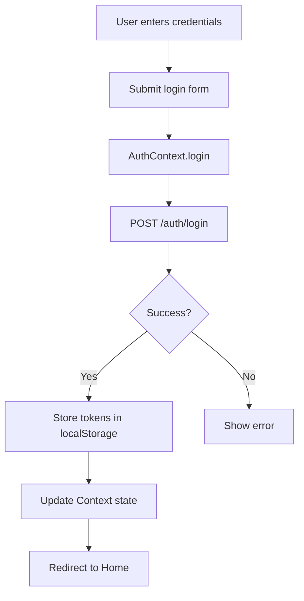
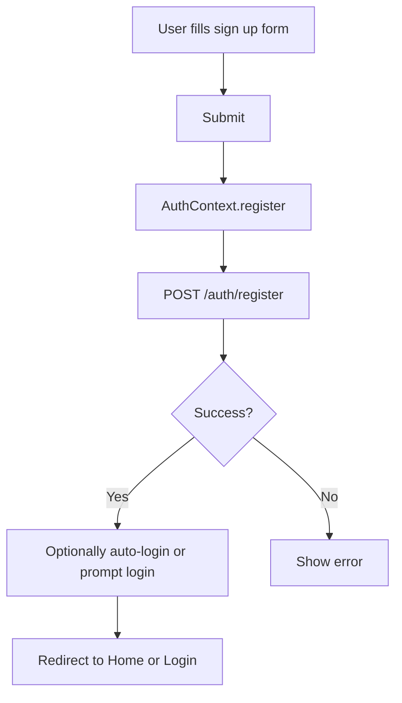
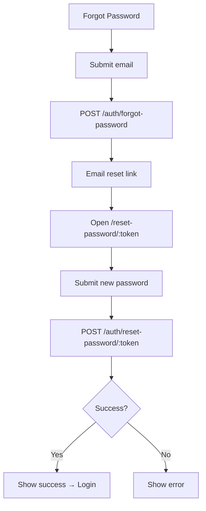
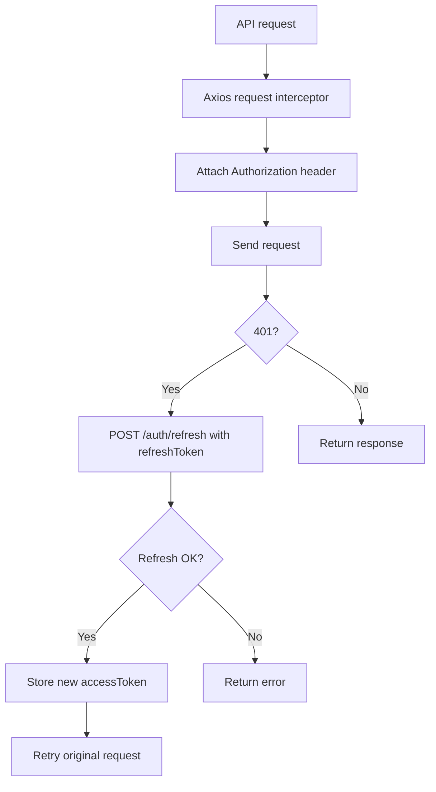

# Client Authentication Documentation

## Table of Contents
1. [Overview](#overview)
2. [Authentication Architecture](#authentication-architecture)
3. [API Endpoints](#api-endpoints)
4. [Authentication Functions](#authentication-functions)
5. [Header Behavior & Pages](#header-behavior--pages)
6. [Button Handler & Form Submit Functions](#button-handler--form-submit-functions)
7. [Authentication Flows](#authentication-flows)
8. [Token Management](#token-management)
9. [Error Handling](#error-handling)
10. [State Management](#state-management)
11. [Protected Routes](#protected-routes)
12. [Best Practices](#best-practices)
13. [Security Considerations](#security-considerations)
14. [Troubleshooting](#troubleshooting)
15. [Quick Reference](#quick-reference)

---

## Overview

The client storefront uses a JWT (JSON Web Token) based authentication system powered by the shared backend `@server`. It supports the following features:

- **Email/Password Authentication**
- **Password Reset Flow** (Forgot → Reset)
- **Persistent Sessions**
- **Token Auto-Refresh**
- **Optional Social Login (future)**: Google, Apple ID, Instagram

### Key Technologies
- **Context API**: Global auth state management
- **Redux Toolkit + Persist (planned/optional)**: Persistent state
- **Axios**: HTTP client with interceptors
- **React Router**: Public vs protected route navigation
- **React Hot Toast (planned)**: User notifications

---

## Authentication Architecture

### File Structure
```
client/src/
├── contexts/
│   └── AuthContext.jsx            # Main authentication context
├── pages/
│   └── auth/
│       ├── Login.jsx              # Login page
│       ├── Register.jsx           # Sign up page
│       ├── ForgotPassword.jsx     # Forgot password page
│       └── ResetPassword.jsx      # Reset password page
├── utils/
│   └── api.js                     # API client and endpoints
└── store/
    └── slices/authSlice.js        # Redux auth slice (optional)
```

### State Management Flow
```
User Action → AuthContext Function → API Call → Update State → UI Update
                                                      ↓
                                              localStorage Update
                                                      ↓
                                           (Redux Persist - optional)
```

---

## API Endpoints

### Base URL
```javascript
const API_BASE_URL = import.meta.env.VITE_API_BASE_URL // e.g. 'http://localhost:5000/api'
```

### Auth Endpoints (served by @server)

#### 1. Login
- Endpoint: `POST /auth/login`
- Payload:
  ```javascript
  {
    identifier: "email@example.com", // Email or phone (if supported)
    password: "userPassword"
  }
  ```
- Response:
  ```javascript
  {
    success: true,
    data: {
      user: { id, firstName, lastName, email, phone, isActive, isVerified },
      accessToken: "eyJhbGc...",
      refreshToken: "eyJhbGc..."
    }
  }
  ```

#### 2. Register (Sign Up)
- Endpoint: `POST /auth/register`
- Payload:
  ```javascript
  {
    firstName: "John",
    lastName: "Doe",
    email: "john@example.com",
    phone: "254712345678",
    password: "SecurePass123",
    confirmPassword: "SecurePass123"
  }
  ```
- Response:
  ```javascript
  {
    success: true,
    data: {
      message: "Registration successful.",
      user: { id, email, phone }
    }
  }
  ```

#### 3. Forgot Password
- Endpoint: `POST /auth/forgot-password`
- Payload:
  ```javascript
  { email: "john@example.com" }
  ```
- Response:
  ```javascript
  { success: true, message: "Password reset link sent to your email" }
  ```

#### 4. Reset Password
- Endpoint: `POST /auth/reset-password/:token`
- Payload:
  ```javascript
  { newPassword: "NewSecurePass123" }
  ```
- Response:
  ```javascript
  { success: true, message: "Password reset successfully" }
  ```

#### 5. Get Current User
- Endpoint: `GET /auth/me`
- Headers: `Authorization: Bearer {accessToken}`
- Response:
  ```javascript
  { success: true, data: { user: { id, firstName, lastName, email, phone, isActive, isVerified } } }
  ```

#### 6. Logout
- Endpoint: `POST /auth/logout`
- Headers: `Authorization: Bearer {accessToken}`
- Response:
  ```javascript
  { success: true, message: "Logged out successfully" }
  ```

#### 7. Refresh Token
- Endpoint: `POST /auth/refresh`
- Payload:
  ```javascript
  { refreshToken: "eyJhbGc..." }
  ```
- Response:
  ```javascript
  { success: true, data: { accessToken: "newAccessToken..." } }
  ```

#### 8. Social OAuth (Optional/Future)
- Initiate: `GET /auth/google` → `{ authUrl: "https://accounts.google.com/..." }`
- Callback: `POST /auth/google/callback` → returns `{ user, tokens }`

---

## Authentication Functions

### AuthContext API (client)

#### 1. login(credentials)
Authenticates user with email and password.
```javascript
const login = async (credentials) => {
  // credentials: { identifier, password }
  // Returns: { success: true/false, error?: string }
}
```

#### 2. register(userData)
Registers a new account.
```javascript
const register = async (userData) => {
  // userData: { firstName, lastName, email, phone, password, confirmPassword }
  // Returns: { success: true/false, data?: object, error?: string }
}
```

#### 3. forgotPassword(email)
Sends password reset link to email.
```javascript
const forgotPassword = async (email) => {
  // Returns: { success: true/false, error?: string }
}
```

#### 4. resetPassword(token, newPassword)
Resets password using token from email link.
```javascript
const resetPassword = async (token, newPassword) => {
  // Returns: { success: true/false, error?: string }
}
```

#### 5. logout()
Clears auth data and redirects to login.
```javascript
const logout = async () => {
  // Returns: void
}
```

#### 6. clearError()
Clears global auth error state.
```javascript
const clearError = () => {}
```

### Auth Context State
```javascript
{
  user: {
    id, firstName, lastName, email, phone, isActive, isVerified
  } | null,
  isAuthenticated: boolean,
  isLoading: boolean,
  error: string | null
}
```

---

## Header Behavior & Pages

### Header (`client/src/components/common/Header.jsx`)
- **When NOT logged in**: Show an avatar placeholder with a **Login** button that navigates to `/login`.
- **When logged in**: Show user avatar/menu with account links and logout.

### Routes & Pages
- Public
  - `/login` → Login page
  - `/register` → Sign Up page
  - `/forgot-password` → Forgot Password page
  - `/reset-password/:token` → Reset Password page

---

## Button Handler & Form Submit Functions

### Login Page Handlers

#### 1. handleSubmit() - Login Form Submission
```javascript
const handleSubmit = async (e) => {
  e.preventDefault()
  setIsLoading(true)
  setError('')

  try {
    // validate inputs (email/identifier, password)
    const result = await login({ identifier: form.email, password: form.password })
    if (result.success) navigate('/')
    else setError(result.error)
  } finally {
    setIsLoading(false)
  }
}
```

### Forgot Password Handlers

#### 1. handleSubmit() - Forgot Password Form
```javascript
const handleSubmit = async (e) => {
  e.preventDefault()
  setIsLoading(true)
  setValidationErrors({})

  try {
    const result = await forgotPassword(email)
    if (result.success) setIsSubmitted(true)
  } finally {
    setIsLoading(false)
  }
}
```

### Reset Password Handlers

#### 1. handleSubmit() - Reset Password Form
```javascript
const handleSubmit = async (e) => {
  e.preventDefault()
  setIsLoading(true)
  setValidationErrors({})

  try {
    const result = await resetPassword(token, form.newPassword)
    if (result.success) setIsSuccess(true)
  } finally {
    setIsLoading(false)
  }
}
```

### Register (Sign Up) Handlers

#### 1. handleSubmit() - Sign Up Form
```javascript
const handleSubmit = async (e) => {
  e.preventDefault()
  setIsLoading(true)
  setValidationErrors({})

  try {
    const result = await register(form)
    if (result.success) navigate('/')
  } finally {
    setIsLoading(false)
  }
}
```

---

## Authentication Flows

### 1. Email/Password Login Flow


### 2. Registration (Sign Up) Flow


### 3. Forgot/Reset Password Flow


### 4. Token Auto-Refresh Flow


---

## Token Management

### Token Storage
```javascript
localStorage.setItem('accessToken', token)
localStorage.setItem('refreshToken', token)
localStorage.setItem('user', JSON.stringify(user))
```

### Lifecycle
1. On login/register success → store tokens + user
2. On every request → attach `Authorization: Bearer {accessToken}`
3. On 401 → attempt refresh; retry original request on success
4. On logout → clear storage and redirect to `/login`

### Session Persistence
```javascript
useEffect(() => {
  const token = localStorage.getItem('accessToken')
  const user = localStorage.getItem('user')
  if (token && user) {
    // Rehydrate context state from localStorage
  }
}, [])
```

---

## Error Handling

### Strategy
- **Toasts** for operation success/failure
- **Inline form errors** for validation feedback
- **Context error** for global tracking and auto-clear

### Common Error Shapes
```javascript
// Validation (400)
{ response: { status: 400, data: { message: 'Validation failed', errors: { email: 'Invalid' } } } }

// Auth (401)
{ response: { status: 401, data: { message: 'Invalid credentials' } } }

// Server (500)
{ response: { status: 500, data: { message: 'Internal server error' } } }
```

---

## State Management

### Context-Only (baseline)
```javascript
// On login success
dispatch({ type: 'LOGIN_SUCCESS', payload: { user } })
localStorage.setItem('user', JSON.stringify(user))
```

### Redux (optional)
```javascript
dispatch(setAuthSuccess(user))
```

---

## Protected Routes

Enforce authentication for:
- `/wishlist`, `/cart`, `/checkout`, and all `/account/*` routes.

Example guard (conceptual):
```javascript
return isAuthenticated ? <Outlet /> : <Navigate to="/login" replace />
```

---

## Best Practices

- **Always check auth** before rendering protected content
- **Clear sensitive data** on logout
- **Validate inputs** client-side (email/password rules)
- **Use loading states** for all async actions
- **Use HTTPS** in production

---

## Security Considerations

1. Tokens in `localStorage` are vulnerable to XSS; minimize risk and audit inputs
2. Use HTTPS and secure origins in production
3. Short-lived access tokens; longer-lived refresh tokens
4. Avoid placing sensitive data in URLs

---

## Troubleshooting

- "Invalid token" after refresh: clear `accessToken` and trigger `/auth/refresh`
- Password reset email not arriving: verify backend email settings and spam folder
- Redirect loop: ensure `isLoading` resolves and token/user are valid

---

## Quick Reference

### Auth Hook Usage
```javascript
import { useAuth } from '@/contexts/AuthContext'

const MyComponent = () => {
  const { user, isAuthenticated, isLoading, error, login, logout } = useAuth()
  return null
}
```

### API Success Format
```javascript
{ success: true, data: { /* ... */ } }
```

### API Error Format
```javascript
{ success: false, message: 'Error message', errors?: { field: 'message' } }
```

---

## Page Wireframes & Structures

### Login Page (`/login`)
```
┌───────────────────────────────────────────────────────────────┐
│                         LOGIN                                  │
├───────────────────────────────────────────────────────────────┤
│  Title: "Sign in to TEO KICKS"                                 │
│  Subtitle (optional)                                           │
│                                                               │
│  [ Email or Phone ]                                           │
│  [ Password         ]  (👁 toggle)                             │
│  [  Sign In  ]  (loading state)                                │
│                                                               │
│  [Forgot password?]             [Create account]               │
│                                                               │
│  Inline error placeholder (validation/server)                  │
└───────────────────────────────────────────────────────────────┘
```
- Fields: **identifier**, **password**
- States: `isLoading`, `error`, optional `showPassword`
- Links: forgot → `/forgot-password`, register → `/register`

### Register Page (`/register`)
```
┌───────────────────────────────────────────────────────────────┐
│                         SIGN UP                                │
├───────────────────────────────────────────────────────────────┤
│  Title: "Create your account"                                  │
│                                                               │
│  [ First Name ]  [ Last Name ]                                 │
│  [ Email ]       [ Phone (optional) ]                          │
│  [ Password ]    [ Confirm Password ] (strength indicator)     │
│  [  Create Account  ] (loading state)                           │
│                                                               │
│  [Already have an account? Sign in] → /login                   │
│  Inline error placeholder (validation/server)                  │
└───────────────────────────────────────────────────────────────┘
```
- Fields: **firstName**, **lastName**, **email**, **phone?**, **password**, **confirmPassword**
- States: `isLoading`, `error`, `passwordStrength`

### Forgot Password Page (`/forgot-password`)
```
┌───────────────────────────────────────────────────────────────┐
│                     FORGOT PASSWORD                            │
├───────────────────────────────────────────────────────────────┤
│  Title: "Reset your password"                                  │
│  Helper: "Enter your email; we’ll send a reset link."          │
│                                                               │
│  [ Email ]                                                     │
│  [  Send reset instructions  ] (loading state)                 │
│                                                               │
│  Success state panel with next steps                           │
│  [Back to sign in] → /login                                    │
└───────────────────────────────────────────────────────────────┘
```
- Field: **email**
- States: `isLoading`, `isSubmitted`, `validationErrors`

### Reset Password Page (`/reset-password/:token`)
```
┌───────────────────────────────────────────────────────────────┐
│                     RESET PASSWORD                             │
├───────────────────────────────────────────────────────────────┤
│  Title: "Set a new password"                                   │
│                                                               │
│  [ New Password ] (👁 toggle)  [ Confirm Password ] (👁)        │
│   Strength meter (0–4)                                         │
│  [  Reset Password  ] (disabled until valid; loading state)     │
│                                                               │
│  Success state → CTA to Login                                  │
└───────────────────────────────────────────────────────────────┘
```
- Fields: **newPassword**, **confirmPassword** (match required)
- States: `isLoading`, `isSuccess`, `passwordStrength`, `validationErrors`

### Header (Unauthenticated)
```
┌─────────────── HEADER ───────────────┐
│  [Logo]        …       [Login] [🛒]   │
└───────────────────────────────────────┘
```
- Show avatar placeholder with a prominent **Login** button routing to `/login`.

---

Last Updated: October 14, 2025  
Version: 1.0.0  
Maintained By: TEO KICKS Development Team


